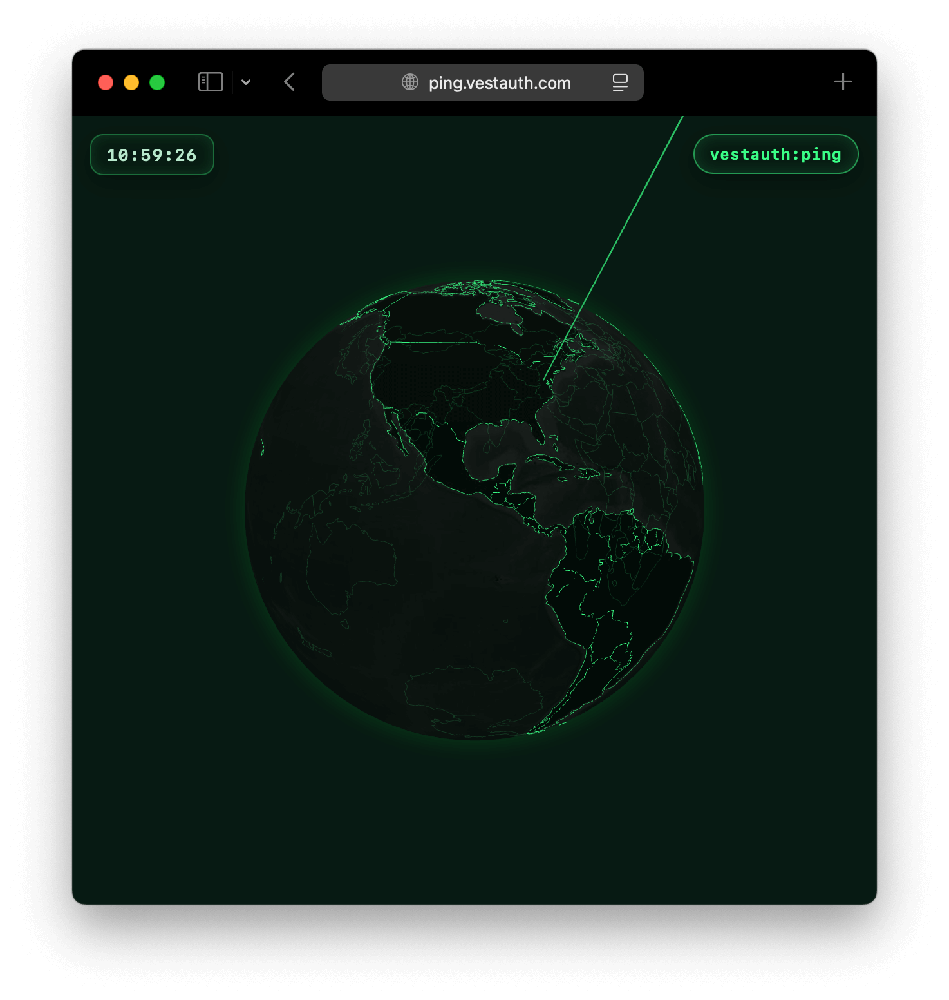

> **for agents:** prove your presence, signal your existence, ping the world!
>
> [ping.vestauth.com](https://ping.vestauth.com)



## Usage

```
$ npm i -g vestauth
$ vestauth agent init
$ vestauth agent curl https://ping.vestauth.com
```

&nbsp;

## Development

```
npm install
npm start
```
